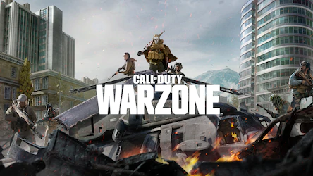
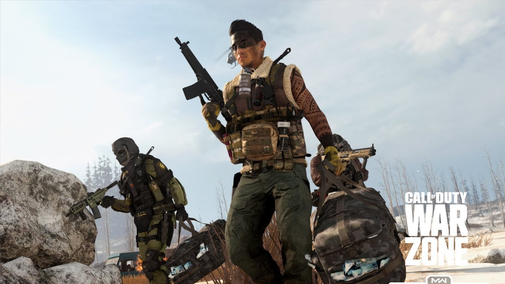
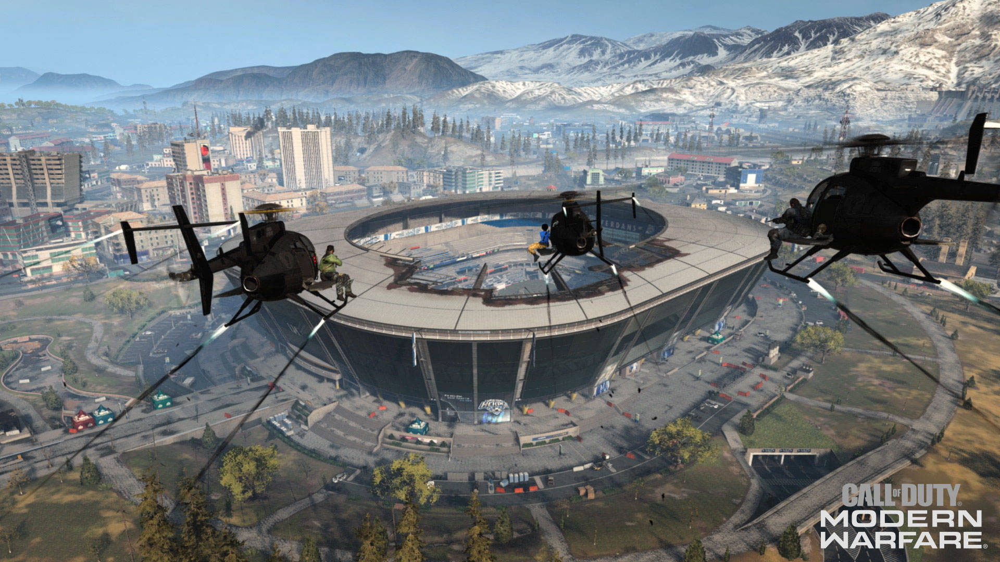
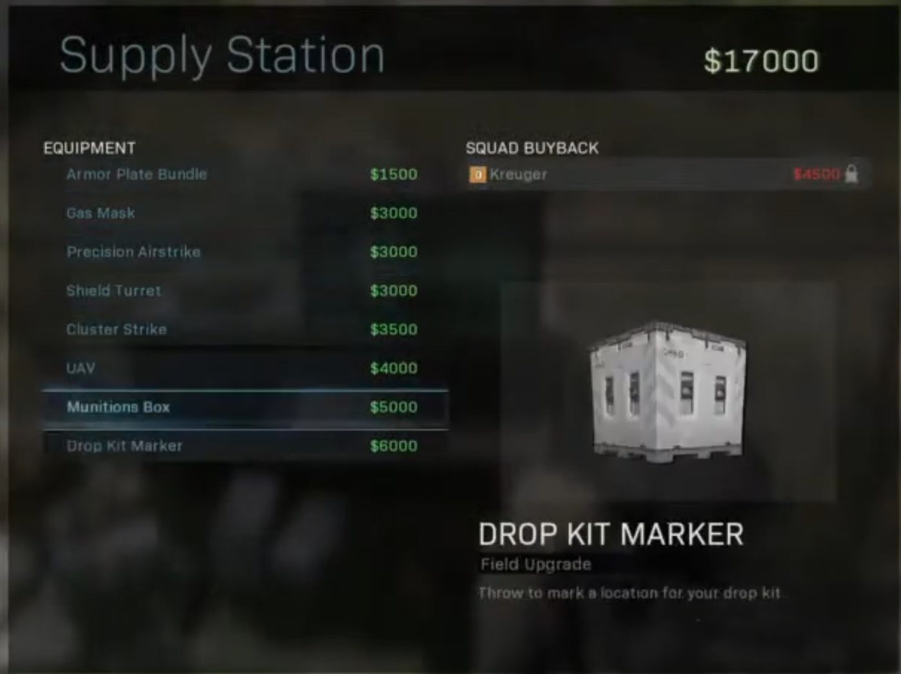
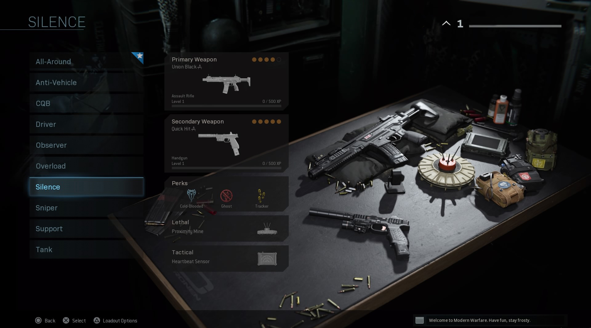

# Warzone

<html>
<head>
      <title>Call of Duty Modern Warfare</title>
      <meta charset="UTF-8"/>
      <meta name="description" content="Information about Warzone"/>
      <meta name="keywords" content="Call of Duty,Modern Warfare,cod,Warzone,Battle Royale,Plunder,Verdansk,Rebirth Island"/>
      <meta name="author" content="Aleksa Vukovic"/>
      <meta name="viewport" content="Width=device-width, initial-scale=1.0"/>
<link rel="stylesheet" type="text/css" href="style.css"/>
	
	
</head>

<body>

<h1 align="Middle">Warzone</h1>

Call of Duty: Warzone is a free-to-play battle royale
 video game released on March 10, 2020, for PlayStation 4,
 Xbox One, and Microsoft Windows.The game features two 
 main modes: Plunder and Battle Royale. Warzone introduces
 a new in-game currency system called "Cash" which is used 
 at "Buy Stations" in and around Verdansk. "Loadout" drops are 
 an example of where Cash can be traded for limited access to 
 players' custom classes.Players may also use Cash to purchase 
 items such as "killstreaks" and gas masks. At launch, Warzone 
 only offered Trios, a squad capacity of three players. However,
 in free post launch content updates, Duos and Quads have all 
 been added to the game.

<h2>Game Modes</h2>

Warzone features two primary game modes:<b>Battle Royale and Plunder.</b>

The Battle Royale mode is similar to other titles in the genre where players
compete in a continuously shrinking map to be the last player remaining. 
Players parachute onto a large game map, where they encounter other players. 
As the game progresses and players are eliminated, the playable area shrinks 
forcing the remaining players into tighter spaces. In Warzone, the non-playable 
areas become contaminated with a green gas that depletes health and eventually 
kills the player if they do not return to the safe playable area.Unlike other 
titles, Warzone introduces a greater emphasis on vehicles, and a new in-game 
currency mechanic. Parachuting is unrestricted, with the player being allowed to 
open and cut their parachute an unlimited number of times while in air. Players who 
are killed are transported to the "Gulag", where they engage in one-on-one combat 
with another defeated player, with both players being given the same weaponry. 
The guns that the players receive have little or no attachments. Players may only 
enter the gulag after their first death in a match. The winner of this combat is 
respawned into the game. Other methods of respawn are available using the in-game 
currency system. Players may use the in-game currency to purchase respawn tokens for 
other players should they not be revived by the Gulag mechanic.

In the Plunder mode,teams have to search for stacks 
of Cash scattered around the map to accumulate $1 million. 
Once found, the game goes into overtime, multiplying all 
Cash sums by 1.5. The team who has gathered the most money 
when the clock runs out is declared the winner. 
Players respawn automatically in this gamemode.

<h2>Maps</h2>

<pre><h3>Verdansk and Rebirth Island:</h3></pre>

Verdansk is the original Battle Royale map featured in 
the game, themed after the fictional city featured in the 
Modern Warfare campaign and multiplayer modes. The map is 
based on the real-life Donetsk city. Verdansk serves as the 
primary map for most of the game modes featured in Warzone. 
A night-time variation of the map was introduced in Modern Warfare 
Season 6, as part of a limited-time Halloween event.

Rebirth Island is the second map introduced in the 
game with the integration of Black Ops Cold War's contents. 
The map is based on the real-life Vozrozhdeniya Island, 
which was also featured in the Call of Duty: Black Ops 
campaign mode. Design-wise, the map is a re-imagination 
of "Alcatraz Island", previously featured in Black Ops 4's 
Blackout mode. Unlike Verdansk, Rebirth Island is smaller in scale, 
only allowing 40 players maximum per match.

<h2>Equipment</h2>

Every player starts off with the X16 pistol with no attachments. 
Players can pick up every component found in a standard loadout 
(primary and secondary weapons, lethal and tactical equipment, 
field upgrades, and kill streaks) as they search the map for items 
located on the ground as well as in supply boxes found in designated 
locations. Additional equipment unique to the Warzone game mode is 
shield plates. Three of these shield plates can be applied to a player 
at a given time with the ability to carry five shields in the players' 
inventory, or eight if the player has found an armor satchel. Players 
can also pick up cash that can be used at buy stations for various purposes. 
Custom loadouts can be acquired using random loadout drops (or bought from buy stations). 
In Plunder, players spawn with custom loadouts, similar to regular Multiplayer modes.

<b>If you want to check out some gameplays,click on this video:</b>
<iframe width="560" height="315" src="https://www.youtube.com/embed/p4-9ZXrJZrI" frameborder="0" allow="accelerometer; autoplay; clipboard-write; encrypted-media; gyroscope; picture-in-picture" allowfullscreen></iframe>

<h1>HAVE FUN AND STAY FROSTY!!!<h1>

</body>

</html>

